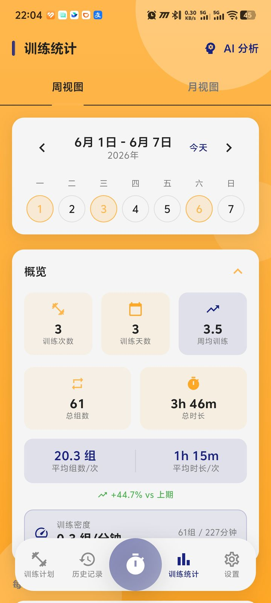
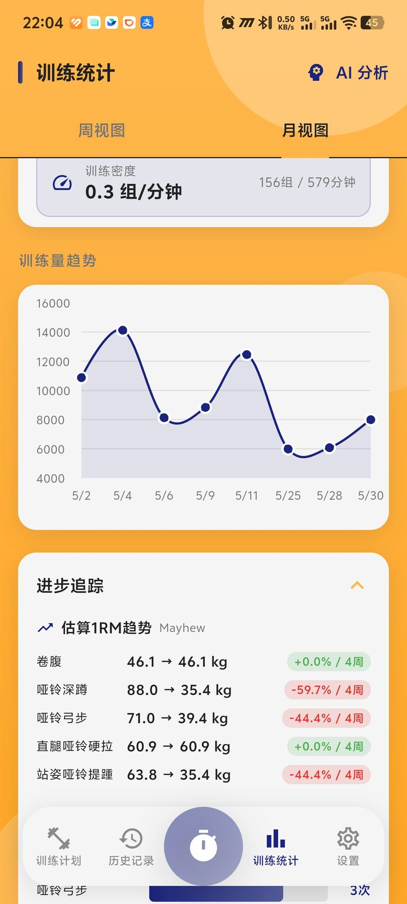
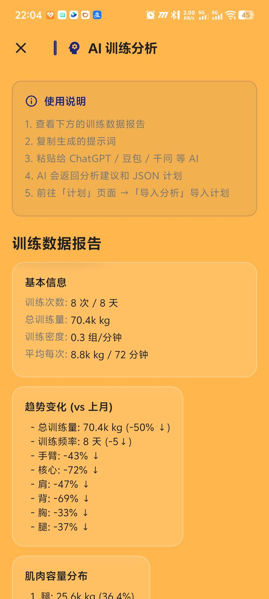

<div align="center">

# 🏋️ 撸铁计时器

**组间休息，精准掌控**

[](https://flutter.dev)
[](https://dart.dev)
[](LICENSE)
[](https://github.com/Kaiji-Z/workout-timer/releases)

免费 · 开源 · 无广告 · 无会员 · 数据不上传

[下载 APK](https://github.com/Kaiji-Z/workout-timer/releases) · [功能](#-功能) · [构建](#-从源码构建) · [技术栈](#-技术栈)

</div>

---

## 这是什么？

一个**只做一件事**的健身 App：帮你管好组间休息。

你一定经历过——做完一组卧推，拿起手机，刷了 15 分钟短视频，身体凉了，训练状态全没了。撸铁计时器就是为解决这个问题而生。

按下开始，倒计时。时间到了，声音+振动提醒你。就这么简单。

但如果你需要更多——训练计划、动作库、每组重量记录、数据统计——它也能做到。

---

## ✨ 功能

### ⏱️ 计时器

| | |
|---|---|
| 预设休息 | 30秒 / 60秒 / 90秒 / 120秒，一键切换 |
| 大号倒计时 | 训练中不用眯眼看屏幕 |
| 后台计时 | 锁屏后继续倒计时，不中断 |
| 多重提醒 | 声音 + 振动 + 通知弹窗 |
| 组数统计 | 自动记录完成了几组 |
| 完成动画 | 训练结束时圆环变奖牌 |

### 📚 动作库

- **870+ 专业动作**，覆盖胸/背/腿/肩/臂/核心全部肌群
- 每个动作附带示范图片
- 中英文双语搜索，模糊匹配
- 按肌群、器械筛选
- 收藏常用动作

### 📋 训练计划

- **AI 生成计划**：输入训练目标，一键生成完整训练方案
- 日历视图安排每日训练
- 计划内动作支持自定义组数、次数
- 执行计划时自动引导，逐个动作推进

### 📊 训练记录

- 每组记录**重量 × 次数**，精确追踪进步
- 自重动作自动计算训练量（生物力学系数）
- 周/月/年统计 + 肌群训练分布环形图
- 力量进步趋势图 + 1RM 估算
- 肌群恢复状态追踪
- AI 训练分析报告

### 🎨 外观

- **3 种主题**：琥珀金 / 珊瑚橙 / 天际蓝
- **深色模式**：每种主题自动生成深色变体
- Flat Vitality 设计系统 — 温暖渐变 + 深蓝强调色
- 按压动画、数字动画、页面转场动画
- 全面无障碍支持（Tooltip、语义标注、实时播报）

### 🔒 隐私

- **所有数据只存你手机上**（SQLite 本地数据库）
- 没有账号注册，没有云同步，没有数据上传
- 不收集任何个人信息
- 支持导出全部数据（JSON 格式）

---

## 📸 界面

| 计时器 | 训练计划 | 历史记录 |
|:---:|:---:|:---:|
|  |  |  |
| 大号倒计时 + 进度环 | 日历 + 计划卡片 | 训练记录列表 |

| 统计概览 | 统计详情 | AI 分析 |
|:---:|:---:|:---:|
|  |  |  |
| 周数据 + 概览 | 容量趋势图 | 智能训练报告 |

| AI 向导 | 动作库 | 动作详情 |
|:---:|:---:|:---:|
|  |  |  |
| 生成训练计划 | 870+ 动作搜索 | 动作示范 + 说明 |

| 设置 |
|:---:|
|  |
| 通知 · 深色模式 · 主题切换 |

---

## 🚀 快速开始

### 下载安装

直接下载最新 APK 安装即可：

👉 [**GitHub Releases**](https://github.com/Kaiji-Z/workout-timer/releases)

👉 [**Gitee 镜像**](https://gitee.com/kaiji1126/workout-timer/releases)

### 从源码构建

```bash
git clone https://github.com/Kaiji-Z/workout-timer.git
cd workout-timer
flutter pub get
flutter run

# 构建 release APK
flutter build apk --release --no-tree-shake-icons
```

<details>
<summary>🇨🇳 国内镜像</summary>

```bash
export PUB_HOSTED_URL=https://pub.flutter-io.cn
export FLUTTER_STORAGE_BASE_URL=https://storage.flutter-io.cn
```
</details>

---

## 🛠️ 技术栈

| 技术 | 用途 |
|------|------|
| Flutter 3.10+ / Dart 3.10+ | 跨平台 UI |
| Provider (ChangeNotifier) | 状态管理 |
| SQLite (sqflite) | 本地数据库，4 版增量迁移 |
| fl_chart | 数据可视化 |
| flutter_local_notifications | 通知提醒 |
| Orbitron + Rajdhani | 计时器专用字体 |

---

## 📁 项目结构

```
lib/
├── main.dart                 # 入口，MultiProvider，底部导航
├── bloc/                     # 状态管理 (ChangeNotifier × 5)
│   ├── timer_provider.dart   # 倒计时 + 组数
│   ├── training_provider.dart # 训练状态机
│   ├── plan_provider.dart    # 计划 CRUD
│   ├── record_provider.dart  # 训练记录 + 统计
│   └── training_progress_provider.dart # 实时训练进度
├── models/                   # 数据模型 (fromMap/toMap/copyWith)
├── screens/                  # 12 个页面
├── widgets/                  # 可复用组件 (15+)
├── theme/                    # Flat Vitality 主题系统
│   ├── app_theme.dart        # 3 主题 + 深色变体
│   └── theme_provider.dart   # 主题状态 + 持久化
├── animations/               # 动画原语
│   ├── animation_primitives.dart # AnimatedCard, CountUp, Shimmer
│   └── page_transitions.dart # FadeUpPageRoute, ScaleFadePageRoute
├── services/                 # 数据库、通知、AI、统计
│   ├── database_helper.dart  # SQLite v4，增量迁移
│   ├── notification_service.dart
│   ├── ai_prompt_service.dart
│   ├── stats_calculator_service.dart
│   └── ...
├── utils/
│   └── dimensions.dart       # AppDimensions 设计 token
└── data/                     # 870+ 动作静态 JSON
```

---

## 🤝 贡献

欢迎提 Issue 和 PR。

1. Fork → 2. 创建分支 → 3. 提交 → 4. Push → 5. 创建 Pull Request

---

## 📄 许可证

[MIT License](LICENSE)

---

## 🙏 致谢

| 资源 | 来源 |
|------|------|
| 健身动作数据库 | [yuhonas/free-exercise-db](https://github.com/yuhonas/free-exercise-db) (CC0) |
| Orbitron 字体 | [Google Fonts](https://fonts.google.com/specimen/Orbitron) (SIL OFL) |
| Rajdhani 字体 | [Google Fonts](https://fonts.google.com/specimen/Rajdhani) (SIL OFL) |

---

<div align="center">

**觉得有用？给个 Star ⭐**

[](https://star-history.com/#Kaiji-Z/workout-timer&Date)

</div>
