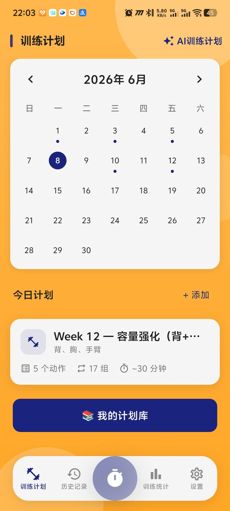
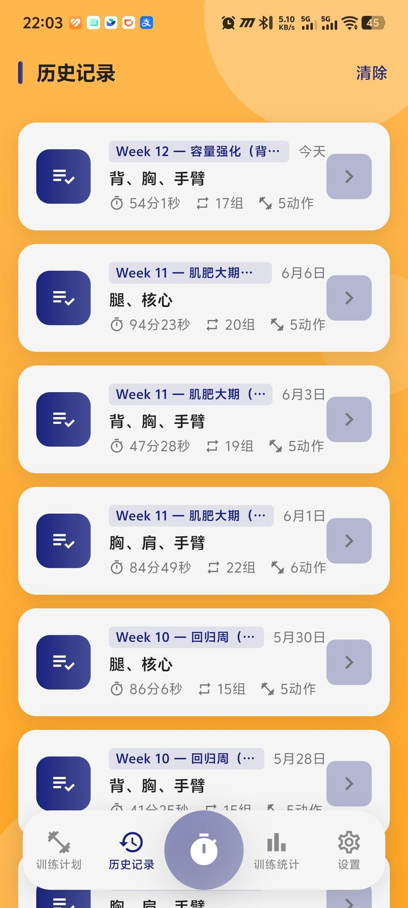
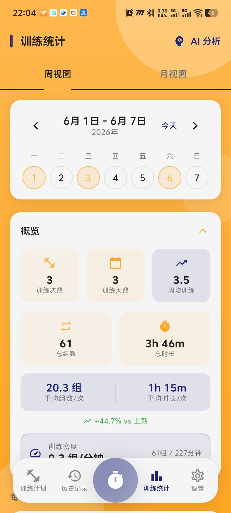
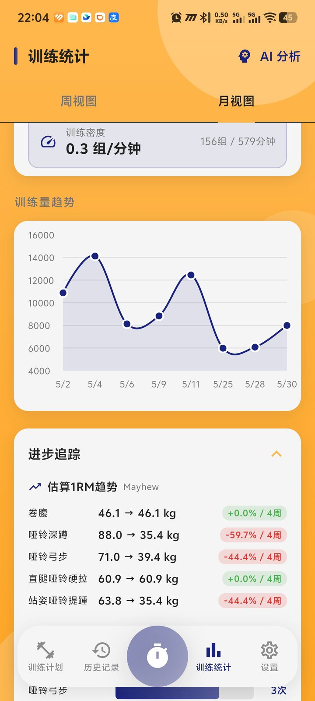
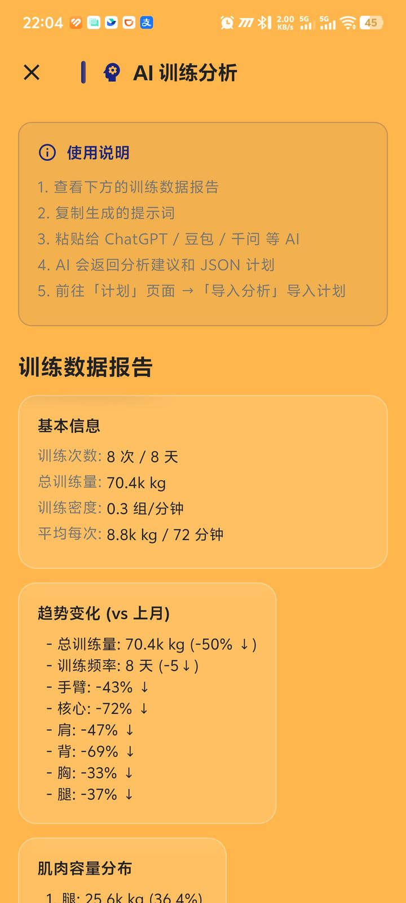
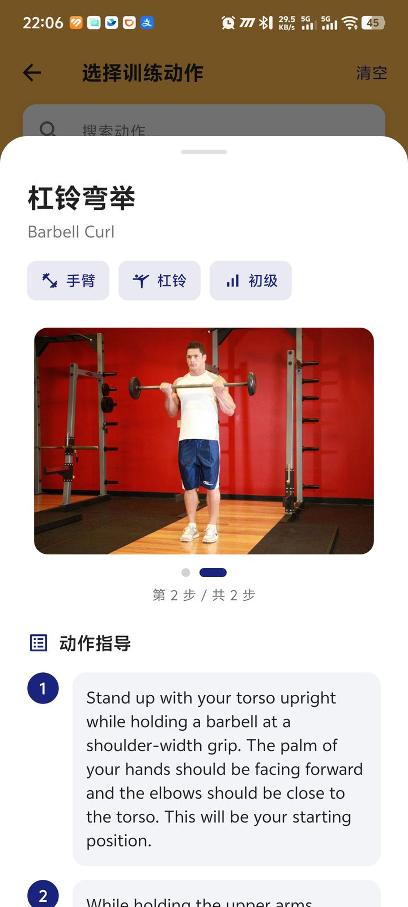
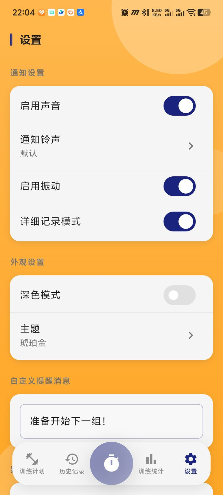

<div align="center">

# 🏋️ Iron Timer

**Own your rest. Own your set.**

🌐 [简体中文](README.md) | **English**

[](https://flutter.dev)
[](https://dart.dev)
[](LICENSE)
[](https://github.com/Kaiji-Z/workout-timer/releases)

Free · Open Source · No Ads · No Sign-up · No Cloud

[Download APK](https://github.com/Kaiji-Z/workout-timer/releases) · [Features](#-features) · [Build](#-build-from-source) · [Tech Stack](#-tech-stack)

</div>

---

## What is this?

A fitness app that does **one thing** well: manage your rest between sets.

You know the feeling — you finish a set of bench press, pick up your phone, and 15 minutes of short videos later your body has gone cold and your training momentum is gone. Iron Timer exists to fix that.

Press start, the countdown runs. Time's up, you get a sound + vibration nudge. That simple.

But if you need more — training plans, an exercise library, per-set weight logging, data stats — it can do that too.

---

## ✨ Features

### ⏱️ Timer

| | |
|---|---|
| Preset rest | 30s / 60s / 90s / 120s, one tap to switch |
| Huge countdown | No squinting mid-workout |
| Background timing | Keeps counting after screen lock, never interrupts |
| Multi-channel alerts | Sound + vibration + notification banner |
| Set counter | Auto-tracks how many sets you've done |
| Completion animation | The progress ring turns into a medal when you finish |

### 📚 Exercise Library

- **870+ professional exercises** covering chest / back / legs / shoulders / arms / core
- Demo image for every exercise
- Bilingual (CN/EN) search with fuzzy matching
- Filter by muscle group and equipment
- Favorite your go-to exercises

### 📋 Training Plans

- **AI-generated plans**: enter your goal, get a complete program in one tap
- Calendar view to schedule each day's training
- Per-exercise customizable sets and reps
- Guided execution that walks you through exercises one by one

### 📊 Training Log

- Per-set **weight × reps** logging for precise progress tracking
- Auto-computed volume for bodyweight exercises (biomechanics coefficients)
- Weekly / monthly / yearly stats + muscle-group distribution donut chart
- Strength progress trends + 1RM estimation
- Muscle group recovery status tracking
- AI training analysis report

### 🎨 Appearance

- **3 themes**: Amber Gold / Coral Orange / Sky Blue
- **Dark mode**: each theme auto-generates a dark variant
- Flat Vitality design system — warm gradients + deep indigo accent
- Press animations, number animations, page transitions
- Full accessibility support (tooltips, semantic labels, live announcements)

### 🔒 Privacy

- **All data stays on your phone** (local SQLite database)
- No account registration, no cloud sync, no data upload
- Collects no personal information
- Export all your data (JSON format) anytime

---

## 📸 Screenshots

| Timer | Plans | History |
|:---:|:---:|:---:|
|  |  |  |
| Big countdown + progress ring | Calendar + plan cards | Workout log list |

| Stats overview | Stats detail | AI analysis |
|:---:|:---:|:---:|
|  |  |  |
| Weekly data + overview | Volume trend chart | Smart training report |

| AI wizard | Exercise library | Exercise detail |
|:---:|:---:|:---:|
|  |  |  |
| Generate a training plan | 870+ exercise search | Demo + instructions |

| Settings |
|:---:|
|  |
| Notifications · Dark mode · Theme switcher |

---

## 🚀 Quick Start

### Download

Grab the latest APK and install:

👉 [**GitHub Releases**](https://github.com/Kaiji-Z/workout-timer/releases)

👉 [**Gitee mirror (faster in China)**](https://gitee.com/kaiji1126/workout-timer/releases)

### Build from source

```bash
git clone https://github.com/Kaiji-Z/workout-timer.git
cd workout-timer
flutter pub get
flutter run

# Build a release APK
flutter build apk --release --no-tree-shake-icons
```

<details>
<summary>🇨🇳 China mirror (faster downloads)</summary>

```bash
export PUB_HOSTED_URL=https://pub.flutter-io.cn
export FLUTTER_STORAGE_BASE_URL=https://storage.flutter-io.cn
```
</details>

---

## 🛠️ Tech Stack

| Tech | Used for |
|------|----------|
| Flutter 3.10+ / Dart 3.10+ | Cross-platform UI |
| Provider (ChangeNotifier) | State management |
| SQLite (sqflite) | Local database, 4 incremental migrations |
| fl_chart | Data visualization |
| flutter_local_notifications | Notification alerts |
| Orbitron + Rajdhani | Timer-specific fonts |

---

## 📁 Project Structure

```
lib/
├── main.dart                 # Entry, MultiProvider, bottom nav
├── providers/                # State management (ChangeNotifier × 5)
│   ├── timer_provider.dart   # Countdown + set counter
│   ├── training_provider.dart # Training state machine
│   ├── plan_provider.dart    # Plan CRUD
│   ├── record_provider.dart  # Workout log + stats
│   └── training_progress_provider.dart # Real-time training progress
├── models/                   # Data models (fromMap/toMap/copyWith)
├── screens/                  # 11 screens
├── widgets/                  # Reusable components (15+)
├── theme/                    # Flat Vitality theme system
│   ├── app_theme.dart        # 3 themes + dark variants
│   └── theme_provider.dart   # Theme state + persistence
├── animations/               # Animation primitives
│   ├── animation_primitives.dart # AnimatedCard, CountUp, Shimmer
│   └── page_transitions.dart # FadeUpPageRoute, ScaleFadePageRoute
├── services/                 # Database, notifications, AI, stats
│   ├── database_helper.dart  # SQLite v4, incremental migrations
│   ├── notification_service.dart
│   ├── ai_prompt_service.dart
│   ├── stats_calculator_service.dart
│   └── ...
├── utils/
│   └── dimensions.dart       # AppDimensions design tokens
└── data/                     # 870+ static exercise JSON
```

---

## 🤝 Contributing

Issues and PRs welcome.

1. Fork → 2. Create a branch → 3. Commit → 4. Push → 5. Open a Pull Request

---

## 📄 License

[MIT License](LICENSE)

---

## 🙏 Acknowledgements

| Resource | Source |
|------|------|
| Exercise database | [yuhonas/free-exercise-db](https://github.com/yuhonas/free-exercise-db) (CC0) |
| Orbitron font | [Google Fonts](https://fonts.google.com/specimen/Orbitron) (SIL OFL) |
| Rajdhani font | [Google Fonts](https://fonts.google.com/specimen/Rajdhani) (SIL OFL) |

---

<div align="center">

**Found it useful? Drop a Star ⭐**

[](https://star-history.com/#Kaiji-Z/workout-timer&Date)

</div>
