<div align="center">

# 🏋️ Workout Timer

**Own your rest. Own your set.**

🌐 [简体中文](README.md) | **English**

[](https://flutter.dev)
[](https://dart.dev)
[](LICENSE)
[](https://github.com/Kaiji-Z/workout-timer/releases)

Free · Open Source · No Ads · No Sign-up · No Cloud

[Download APK](https://github.com/Kaiji-Z/workout-timer/releases) · [Features](#-features) · [Screenshots](#-screenshots) · [Build](#-build-from-source) · [Tech Stack](#-tech-stack)

</div>

---

| 🏋️ Follow the plan | 📊 Statistics | 🤖 AI plans & analysis |
|:---:|:---:|:---:|
| 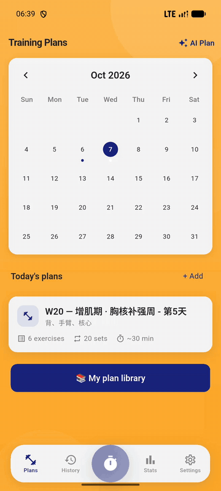 |  | 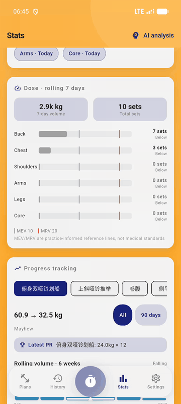 |
| Guided exercises + per-set logging | Recovery · Dose · Progress · Habits | Free AI, zero API keys |

| 📚 Exercise library | 🗂️ Workout history | ⚙️ Training preferences |
|:---:|:---:|:---:|
| 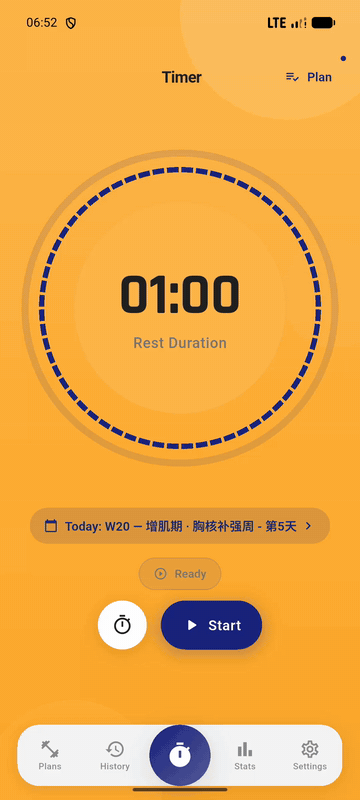 | 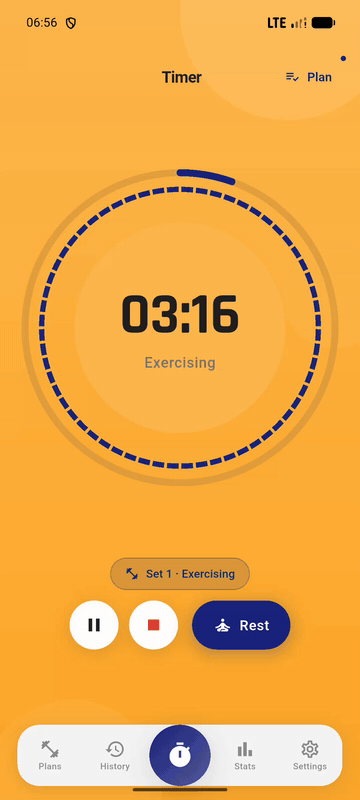 | 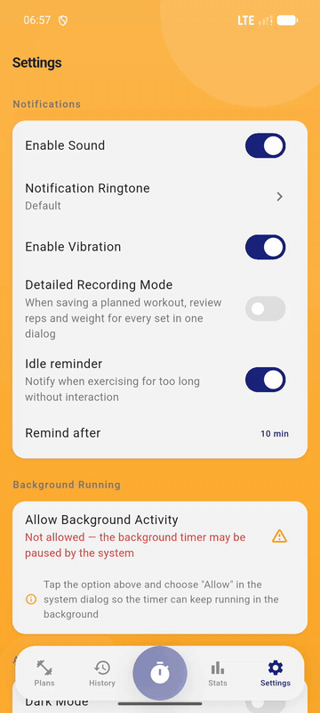 |
| 870+ exercises, bilingual search | Every set, permanently logged | AI reads your profile automatically |

## What is this?

A fitness app that does **one thing** well: manage your rest between sets.

You know the feeling — you finish a set of bench press, pick up your phone, and 15 minutes of short videos later your body has gone cold and your training momentum is gone. Workout Timer exists to fix that.

Press start, the countdown runs. Time's up, you get a sound + vibration nudge. That simple.

But if you need more — training plans, an exercise library, per-set weight logging, data stats — it can do that too.

---

## ✨ Features

### 🤖 AI plans without paying a cent

**No API key, no subscription, no built-in LLM** — that's the whole trick:

1. Fill in a questionnaire (goal / frequency / duration / experience / equipment), and the app writes you a **professional-grade training prompt**
2. Copy the prompt and paste it into **any free AI** you already use (ChatGPT / Gemini / Claude free tiers…)
3. Paste the JSON plan the AI returns back into the app — preview and import it to your calendar in one tap

AI training reviews work the same way: the app turns your training data into a report, your free AI analyzes it, and returns advice plus next week's plan. **Your data + any free AI = a personal coach, at zero cost.**

### ⏱️ Timer

| | |
|---|---|
| Preset rest | 30s / 60s / 90s / 120s, one tap to switch |
| Huge countdown | No squinting mid-workout |
| Background timing | Keeps counting after screen lock, never interrupts |
| Multi-channel alerts | Sound + vibration + notification banner |
| Set counter | Auto-tracks how many sets you've done |
| Completion animation | The progress ring turns into a medal when you finish |

### 📚 Exercise Library

- **870+ professional exercises** covering chest / back / legs / shoulders / arms / core
- Step-by-step demo images + instructions for every exercise
- **Bilingual (CN/EN) search** with fuzzy matching — search English names from a Chinese UI and vice versa
- Filter by muscle group and equipment, favorite your go-to exercises

### 📋 Training Plans

- **AI-generated plans**: prompt → free AI → one-tap import (see above)
- Manual builder: pick muscles → choose exercises → set reps, done in three steps
- Calendar view to schedule each day; today's plan starts from the timer in one tap
- Guided execution that walks you through exercises one by one

### 📊 Training Log & Stats

- Per-set **weight × reps** logging for precise progress tracking
- Auto-computed volume for bodyweight exercises (biomechanics coefficients)
- **Today card**: muscle recovery times + acute/chronic load ratio (guardrail reference)
- **Dose monitoring**: rolling 7-day sets per muscle group against MEV/MRV reference bands
- **Progress**: e1RM estimation trend + recent PRs + 6-week rolling volume
- **Habit heatmap**: full-year check-ins + streak weeks
- AI training analysis report (works with any free AI, see above)

### 🌍 Interface

- **Bilingual English / 中文**, switchable in-app
- **3 themes**: Amber Gold / Coral Orange / Sky Blue, each with an auto-generated dark variant
- Flat Vitality design system — warm gradients + deep indigo accent
- Full accessibility support (tooltips, semantic labels, live announcements)

### 🔒 Privacy

- **All data stays on your phone** (local SQLite database)
- No account registration, no cloud sync, no data upload
- Collects no personal information
- Export / import all your data (JSON format) anytime

---

## 📸 Screenshots

| Timer | Plans | History |
|:---:|:---:|:---:|
| 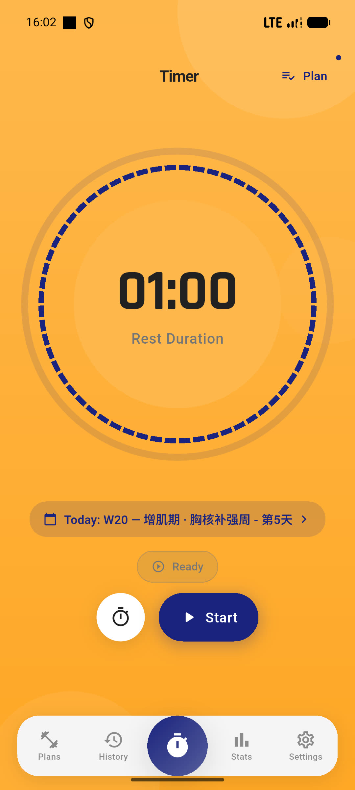 | 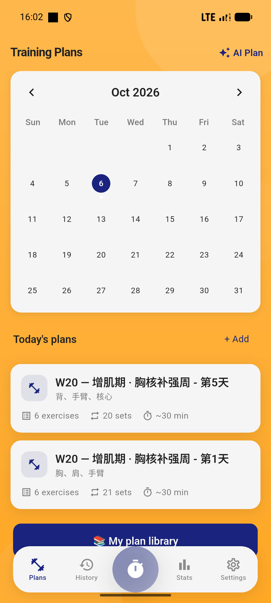 | 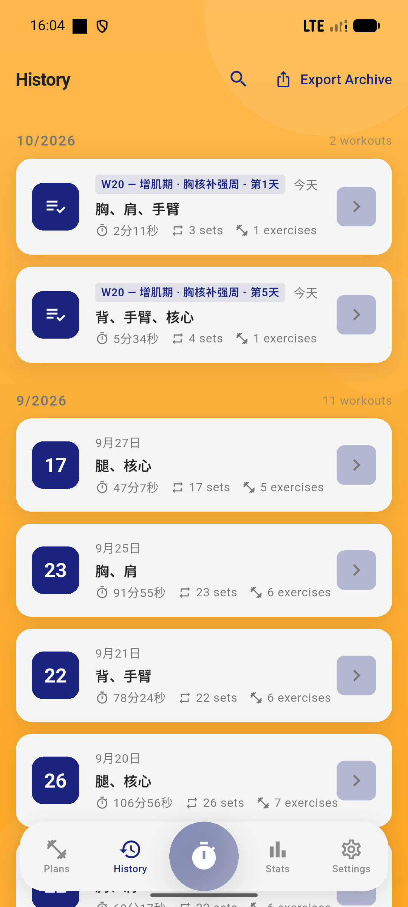 |
| Today's plan + big countdown | Calendar scheduling + plan cards | Workouts archived by month |

| Stats · Today | Stats · Progress & habits | AI analysis |
|:---:|:---:|:---:|
| 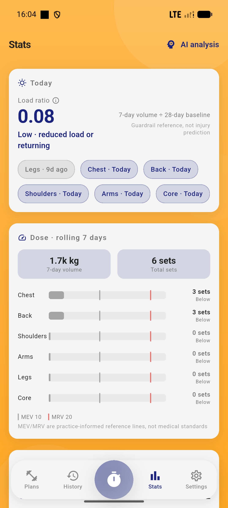 | 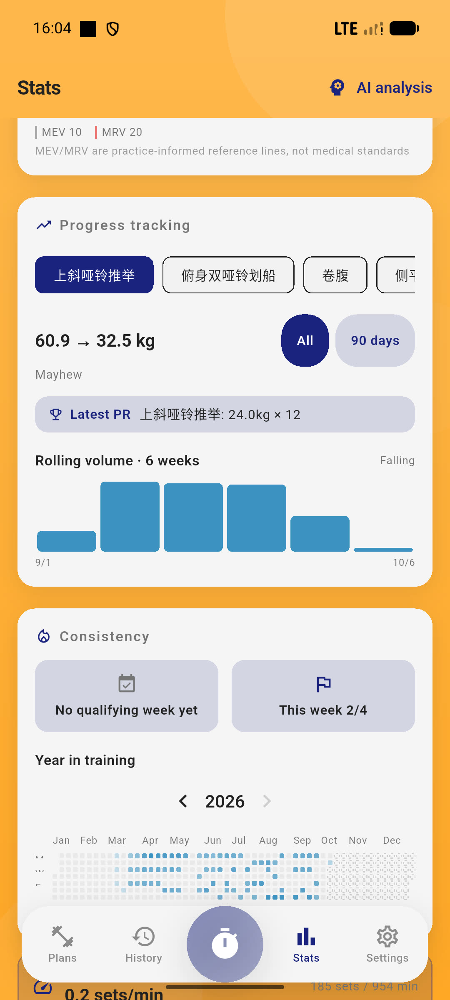 | 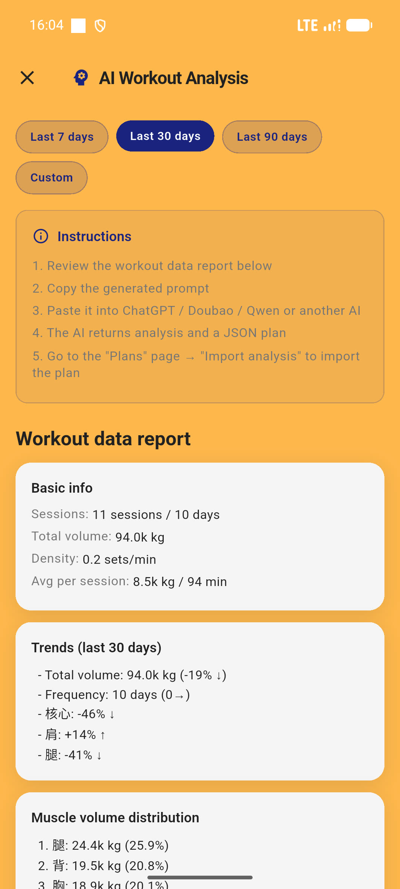 |
| Recovery chips + dose monitoring | e1RM trend + year heatmap | Data report → free AI review |

| AI wizard | Exercise library | Exercise detail |
|:---:|:---:|:---:|
| 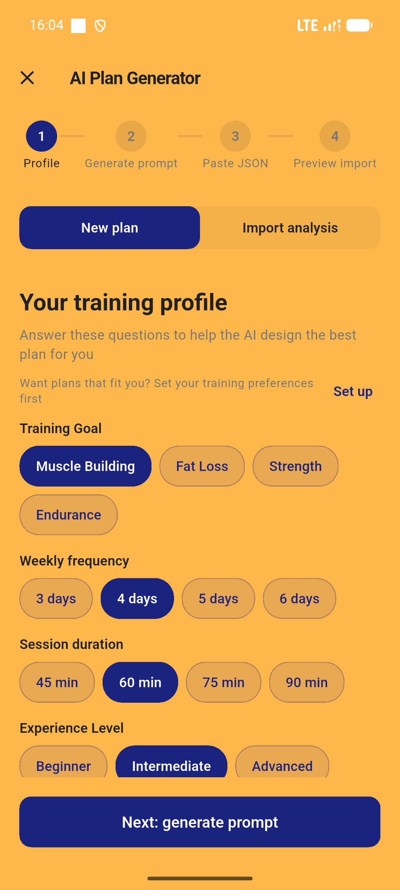 | 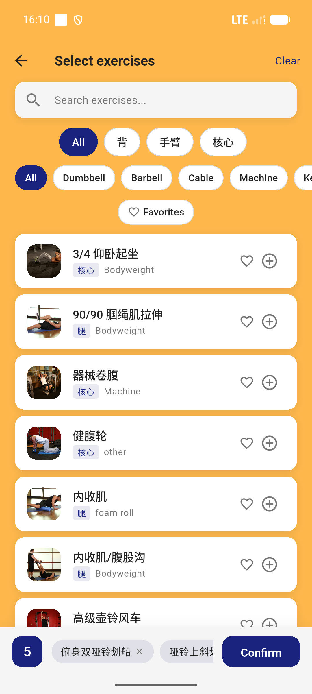 | 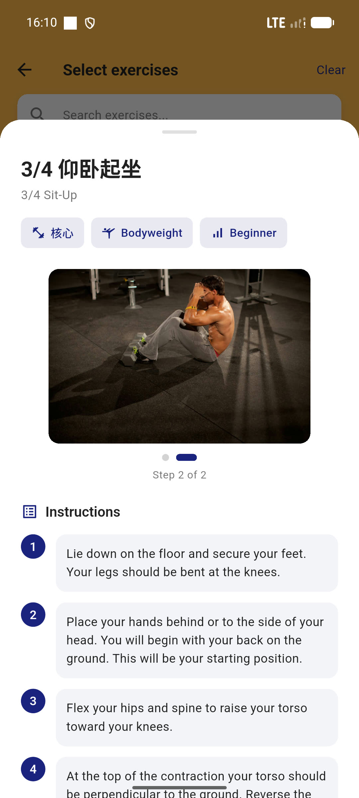 |
| Questionnaire → prompt → import | 870+ exercise search & filters | Step images + instructions |

| Settings |
|:---:|
| 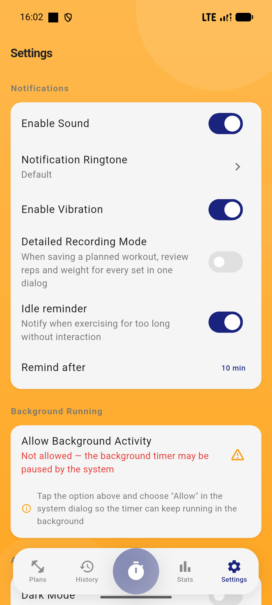 |
| Notifications · Dark mode · Theme · Language · Data |

---

## 🚀 Quick Start

### Download

Grab the latest APK and install:

👉 [**GitHub Releases**](https://github.com/Kaiji-Z/workout-timer/releases)

👉 [**Gitee mirror (faster in China)**](https://gitee.com/kaiji1126/workout-timer/releases)

### Build from source

```bash
git clone https://github.com/Kaiji-Z/workout-timer.git
cd workout-timer
flutter pub get
flutter run

# Build a release APK
flutter build apk --release --no-tree-shake-icons
```

<details>
<summary>🇨🇳 China mirror (faster downloads)</summary>

```bash
export PUB_HOSTED_URL=https://pub.flutter-io.cn
export FLUTTER_STORAGE_BASE_URL=https://storage.flutter-io.cn
```
</details>

---

## 🛠️ Tech Stack

| Tech | Used for |
|------|----------|
| Flutter 3.10+ / Dart 3.10+ | Cross-platform UI |
| Provider (ChangeNotifier) | State management |
| SQLite (sqflite) | Local database, 5 incremental migrations |
| fl_chart | Data visualization |
| flutter_local_notifications | Notification alerts |
| flutter_localizations (gen-l10n) | EN/中文 bilingual UI |
| Rajdhani | Timer-specific font |

---

## 📁 Project Structure

```
lib/
├── main.dart                 # Entry, MultiProvider, bottom nav
├── providers/                # State management (ChangeNotifier × 7)
│   ├── timer_provider.dart   # Countdown + set counter
│   ├── training_provider.dart # Training state machine
│   ├── plan_provider.dart    # Plan CRUD
│   ├── record_provider.dart  # Workout log + stats
│   ├── training_progress_provider.dart # Real-time training progress
│   └── locale_provider.dart  # EN/中文 switching
├── models/                   # Data models (fromMap/toMap/copyWith)
├── screens/                  # 12 screens
├── widgets/                  # Reusable components (30+)
├── theme/                    # Flat Vitality theme system
│   ├── app_theme.dart        # 3 themes + dark variants
│   └── theme_provider.dart   # Theme state + persistence
├── animations/               # Animation primitives
├── services/                 # Database, notifications, AI prompts, stats
│   ├── database_helper.dart  # SQLite v5, incremental migrations
│   ├── ai_prompt_service.dart    # AI plan prompt generation
│   ├── stats_calculator_service.dart # e1RM / volume / dose
│   └── data_transfer_service.dart    # Data export/import
├── utils/
│   └── dimensions.dart       # AppDimensions design tokens
└── data/                     # 870+ static exercise JSON
```

---

## 🤝 Contributing

Issues and PRs welcome.

1. Fork → 2. Create a branch → 3. Commit → 4. Push → 5. Open a Pull Request

---

## 📄 License

[MIT License](LICENSE)

---

## 🙏 Acknowledgements

| Resource | Source |
|------|------|
| Exercise database | [yuhonas/free-exercise-db](https://github.com/yuhonas/free-exercise-db) (CC0) |
| Rajdhani font | [Google Fonts](https://fonts.google.com/specimen/Rajdhani) (SIL OFL) |

---

<div align="center">

**Found it useful? Drop a Star ⭐**

[](https://star-history.com/#Kaiji-Z/workout-timer&Date)

</div>
